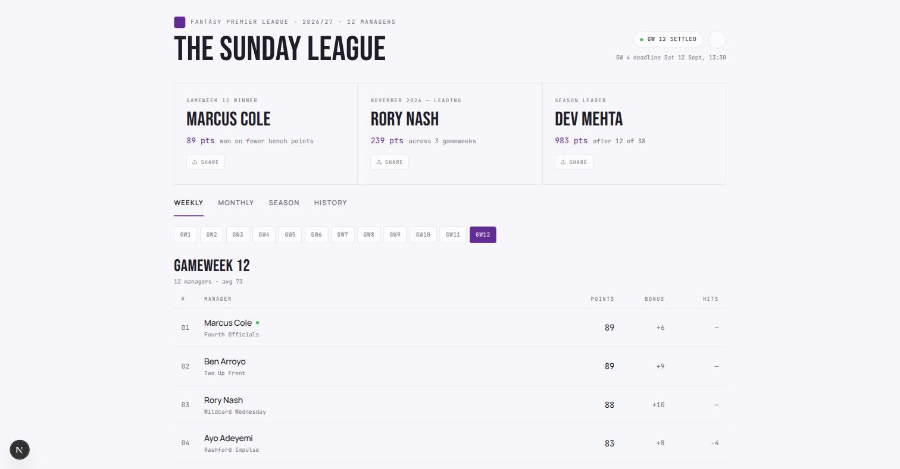
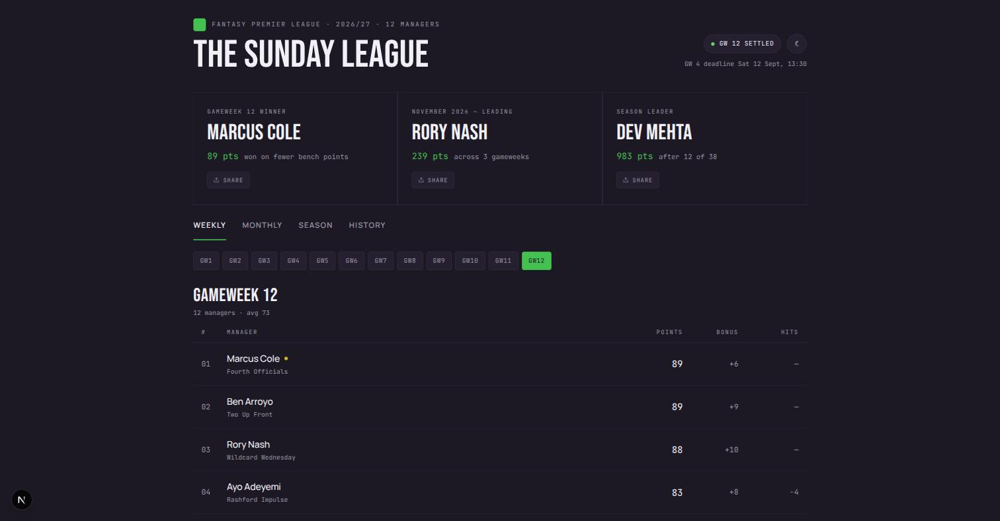

# fpl-mates

A leaderboard for a Fantasy Premier League mini-league, with the competitions
FPL does not give you: **a weekly winner, a monthly winner, and a running
record of who has won what.**

FPL shows your mini-league a single season-long table. This adds the weekly and
monthly ones, works them out from the same official data, and states the rules
in force under every table so nobody has to argue about them.




<sub>Screenshots use the demo data checked into this repo, not a real league.</sub>

---

## What it does

- **Weekly table** — every gameweek scored and ranked, with a declared winner
- **Monthly table** — gameweeks grouped by month, with a monthly winner
- **Season table** — the cumulative standings
- **History** — every weekly and monthly winner so far
- **Live scores** — provisional points while matches are being played, clearly
  marked as provisional, with a fixtures grid and a countdown to the deadline
- **Light and dark**, and it works on a phone

Everything updates on its own. Nobody enters a score by hand.

---

## Deploy your own

Five minutes, and it costs nothing on the free tiers.

### 1. Find your league ID

Open your mini-league on the FPL site and read the number out of the URL:

```
https://fantasy.premierleague.com/leagues/123456/standings/c
                                          ^^^^^^
```

### 2. Create a database

Sign up at [neon.tech](https://neon.tech) and create a project. Pick the region
closest to where you will deploy. From *Connection Details*, copy **both**
connection strings — the pooled one (its host contains `-pooler`) and the direct
one.

### 3. Deploy

Fork this repository, then import it at [vercel.com](https://vercel.com). Set
two environment variables:

| Variable | Value |
|---|---|
| `FPL_LEAGUE_ID` | the number from step 1 |
| `DATABASE_URL` | the **pooled** Neon connection string |

That is genuinely all that is required. Everything else has a working default.

Two more are worth adding:

| Variable | Why |
|---|---|
| `DATABASE_URL_UNPOOLED` | the direct Neon string; migrations need a session connection and fail over a pooler |
| `CRON_SECRET` | any long random string, so only your cron can trigger the poller |

### 4. Create the tables

```bash
pnpm install
cp .env.example .env.local     # fill in the same values
pnpm db:migrate
```

### 5. Check it works

```bash
curl -H "Authorization: Bearer YOUR_CRON_SECRET" https://your-app.vercel.app/api/poll
```

`{"outcome":"skipped"}` is the healthy answer between gameweeks — it means the
API was reachable, the database was written, and there is nothing to score yet.

### Keeping it up to date

`vercel.json` runs the poller daily. **Vercel's Hobby plan rejects any cron that
runs more than once a day**, so there is also a GitHub Actions workflow
(`.github/workflows/poll.yml`) that calls the same endpoint hourly for free. To
use it, set two repository secrets:

- `POLL_URL` — `https://your-app.vercel.app/api/poll`
- `CRON_SECRET` — the same value you set in Vercel

Both together is fine. The poller processes whatever is outstanding rather than
only what is new, so overlapping runs are harmless and a missed one is caught up
automatically.

---

## How the scoring works

Read this before pointing your league at it — these are the rules your group
will be arguing about, and they are all changeable.

**Points are after transfer costs.** FPL charges 4 points for each transfer
beyond your free ones. A manager who scores 80 with a −8 finishes *below* one
who scores 74 clean. Wildcard and Free Hit gameweeks cost nothing, and banked
free transfers (up to five) are free — the deduction always comes from FPL's own
figure, never from counting transfers.

**A gameweek belongs to the month of its deadline**, not the month the matches
were played in. This is deterministic and easy to explain, and it means months
hold unequal numbers of gameweeks — two in August, six in December. That is
expected, not a bug.

**Ties break in a configurable order**, by default: higher score, then fewer
points lost to transfers, then fewer points left on the bench, then better
overall FPL rank. Survive all four and the win is shared.

**Nothing counts until FPL confirms it.** Bonus points settle an hour or more
after the final whistle, and corrections land days later. Live scores are shown
while matches are played, but no winner is recorded until the gameweek is final.

**Managers score from the gameweek they joined the league**, not from the start
of the season. Somebody joining at GW10 arrives with GW1–9 already on FPL's
record; counting those would let them win a month they were not in. Set
`COUNT_PREJOIN_GWS=true` if you would rather count everything.

> **If you set this up mid-season**, the join dates of existing members are not
> recoverable. FPL only reports a join time while a manager is unranked, so
> anyone already in the table when you first run the poller is treated as
> present from Gameweek 1 — which is `COUNT_PREJOIN_GWS=true` behaviour for
> them whatever you set. Members who join *after* you start are dated
> correctly. Starting before the season avoids this entirely.

Whatever you configure is printed underneath every table, so nobody has to read
the source to find out how they lost.

---

## Configuration

Only `FPL_LEAGUE_ID` and `DATABASE_URL` are required. See
[`.env.example`](.env.example) for all of them, commented — including the
tie-break order, timezone, theme colours, live scoring, and the optional
WhatsApp publisher.

A missing optional variable turns a feature off. It never breaks the poller.

The theme is configurable end to end: set `ACCENT_COLOR` and `POP_COLOR` and the
page, the favicon and the link-preview image all follow, because all three are
generated from the same values.

---

## Running locally

```bash
pnpm install
cp .env.example .env.local
pnpm db:migrate
pnpm dev
```

No database and no league to hand? Set `USE_FIXTURES=true` and it renders a
deterministic demo league from `lib/fixtures/`. That is what the screenshots
above show, and it is how the tests run without touching the live API.

```bash
pnpm test        # unit tests: scoring, tie-breaks, month mapping, bonus
pnpm sync        # refresh gameweeks and membership by hand
pnpm poll        # run the poller by hand
pnpm db:check    # verify both connection strings answer
```

---

## Documentation

- [docs/internals.md](docs/internals.md) — how each part works, and why
- [docs/ROADMAP.md](docs/ROADMAP.md) — what is not built yet
- [docs/technical-brief.md](docs/technical-brief.md) — the original specification

---

## Disclaimer

**Not affiliated with, endorsed by, or connected to the Premier League or
Fantasy Premier League.** It reads an undocumented public API that may change or
stop working without notice. Run it at your own risk. See [NOTICE.md](NOTICE.md).

## Licence

[MIT](LICENSE).
